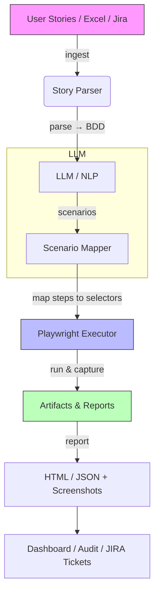

# Automated UAT from User Stories – POC

# AI-driven UAT Automation — Proof of Concept

This repository is a proof-of-concept for an AI-powered UAT (User Acceptance Testing) automation platform. It demonstrates an end-to-end pipeline that converts user stories / acceptance criteria into executable, DOM-aware test scenarios and runs them against a UAT web app using Playwright.

## Flow (architecture)



If your renderer doesn't support Mermaid, here's a compact ASCII flow:

User Stories (Excel/Jira)
  -> Story Parser (NLP)
    -> LLM produces BDD scenarios (Given/When/Then)
      -> Scenario Mapper (maps steps → selectors using LLM or heuristics)
        -> Playwright Executor runs scenarios → captures screenshots, logs
          -> Reporting engine writes JSON + HTML reports in `artifacts/`

## Features (what this POC includes)

- Input sources:
  - Excel file parser (example stories can be uploaded via the app)
  - Manual story POST endpoint
- NLP / LLM parsing:
  - Converts acceptance criteria into BDD-style scenarios
  - Falls back to heuristic parser if LLM unavailable
- LLM client abstraction:
  - Supports Ollama (local), Groq, and OpenAI via a unified client
- DOM mapping & execution:
  - LLM-assisted step→action mapping with robust fallback heuristics
  - Playwright-based executor that uses `data-testid` selectors where possible
  - Screenshot capture on scenario failures
- Reporting:
  - JSON and HTML reports written to `artifacts/<run_id>/report.*`
  - Simple templates in `uat-service/app/templates`
- Web service:
  - FastAPI server exposing endpoints for running stories and uploading Excel files

## Brief theory (why this works)

- Natural language acceptance criteria are structured but ambiguous. An LLM is good at extracting intent and rewriting criteria into explicit BDD steps (Given/When/Then).
- Mapping steps to UI elements is a semantic matching problem: the prototype uses LLM prompts with page HTML context and heuristics prioritizing `data-testid` attributes for robust selectors.
- Playwright provides reliable, headless browser automation suitable for UAT-level flows. Screenshots and DOM snapshots provide traceability.

## Tech stack

- Python 3.11
- FastAPI (server)
- Playwright (executor)
- OpenAI / Ollama / Groq (LLM providers via `llm_client.py`)
- Jinja2 (report templates)
- openpyxl (Excel parsing)

## How to run (PowerShell on Windows)

Recommended: use a virtual environment.

1) Create and activate venv, install dependencies via pip (or use Poetry):

```powershell
python -m venv .venv
.\.venv\Scripts\Activate.ps1
pip install -U pip
pip install fastapi uvicorn openai spacy python-dotenv playwright jinja2 sqlmodel openpyxl python-multipart requests
python -m playwright install
```

2) Start the sample front-end (optional) — this repo includes a minimal `sample-app` that serves `index.html`.

```powershell
cd "sample-app"
# install dependencies if you haven't already
npm install
node server.js
# sample app serves public/index.html (default port printed by server.js)
```

3) Start the FastAPI service

```powershell
cd "uat-service"
uvicorn app.main:app --reload --host 0.0.0.0 --port 8000
```

4) Use the UI at `http://localhost:8000/` to run stories or upload Excel files. Or call the API:

Example curl (PowerShell) — run a single story:

```powershell
$body = @'
{
  "title": "Invite user",
  "acceptance_criteria": [{"text": "As an Admin, I can invite a new user by email. Given Admin is logged in. When Admin fills Invite form with email and role and clicks Invite. Then the system sends verification email and assigns the role."}],
  "target_url": "http://localhost:5173"
}
'@

curl -Method POST -Uri "http://localhost:8000/stories:run" -ContentType "application/json" -Body $body
```

Notes:
- Ensure LLM provider is configured in environment variables (e.g., `OPENAI_API_KEY` or `OLLAMA_BASE_URL`).
- Playwright requires browser binaries; `python -m playwright install` installs them.

## Files and locations (quick map)

- `uat-service/app/` — main service code:
  - `main.py` — FastAPI app and endpoints
  - `nlp.py` — convert acceptance criteria → BDD scenarios
  - `llm_client.py` — unified LLM client
  - `executor.py` — Playwright execution and mapping
  - `excel_parser.py` — Excel ingestion
  - `reporting.py` — JSON/HTML report generation
- `sample-app/public` — minimal sample web app with `data-testid` attributes
- `artifacts/` — sample run artifacts (existing PRs or previous runs)

---


## Notes and Extensibility
- Uses LLM for intelligent parsing and mapping (falls back to heuristics if API key not set)
- All UI elements use `data-testid` attributes for reliable test automation
- Reports saved at `uat-service/artifacts/<runId>/`
- Set default target via `SAMPLE_APP_URL` environment variable
- Next: Jira CSV import; embeddings-based semantic matching; richer DOM mapping; multi-browser support

## E-Commerce App Features
- **Homepage**: Product grid with 6 sample products
- **Shopping Cart**: View, manage, and remove cart items
- **Checkout**: Complete order with shipping and payment information
- **Cart Persistence**: Uses localStorage to maintain cart across page navigation
